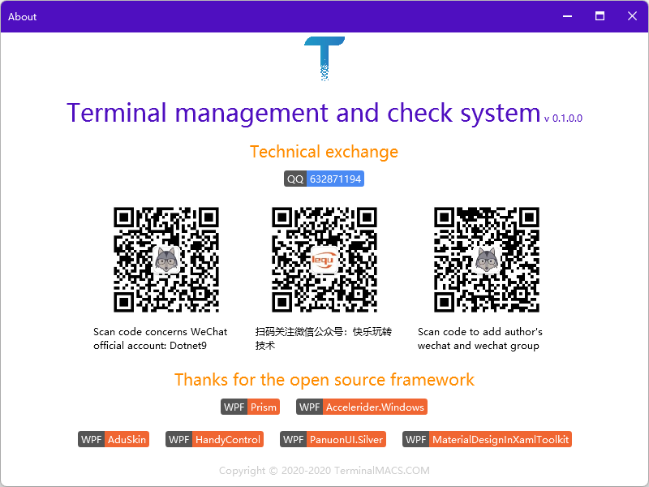

  

<h1 align="center">TerminalMACS</h1>

One dotNet 5 WPF client project, which uses prism as a modular framework, selects multiple open source control libraries as UI controls, and integrates open source UI design.

English | [简体中文](./README-zh_CN.md)

## 1. Features

- Use [.NET 5](https://dotnet.microsoft.com/download/dotnet/5.0?utm_source=dotnet-website&utm_medium=banner&utm_campaign=preview5-banner) development to experience the latest .Net platform (seamless compatibility with. Net core 3.1)

>.Net 5 is the future of. Net Framework and. Net Core, and will eventually become a unified platform .Net 5 will contain ASP.NET Core, Entity Framework core, WinForms, WPF, Xamarin and ML.NET 。

- Build modular framework based on [Prism 8](https://github.com/PrismLibrary/Prism) to facilitate program expansion

>Prism provides guidance for programming to help users design and build rich, flexible and easy to maintain WPF desktop applications more easily. Prism uses design patterns (such as MVVM, composite view, event aggregator) to help you create a loosely coupled program. Following these design pattern principles, the target program is decoupled into independent modules. These types of applications are called composite applications.

- Used or about to use multiple open source WPF control Libraries

>A variety of open source WPF UI library options make it easier to develop WPF projects: [MaterialDesignInXamlToolkit](https://github.com/MaterialDesignInXAML/MaterialDesignInXamlToolkit)、 [HandyControl](https://github.com/HandyOrg/HandyControl)、 [PanuonUI.Silver](https://github.com/Panuon/PanuonUI.Silver)、 [AduSkin](https://github.com/aduskin/AduSkin)。

- ECharts

ECharts：[pie-doughnut](https://echarts.apache.org/examples/zh/editor.html?c=pie-doughnut)

- Localization support

- Dynamic internationalization support

- Support theme color dynamic switching

## 2. Environment Support

- .NET 5.0。

## 3. Current Version

0.1

## 4. Links

- Official website：[Dotnet9](https://dotnet9.com)

## 5. Screenshot of project interface

### 5.1. About

  

About of TerminalMACS

### 5.2. Home module

### 5.3. Server module

### 5.4. Client module

### 5.5. Test demo

Collect the world's best open source WPF interface design

**Login registration category 1**

1. Simple login form design 1

Reference video:[C# WPF Material Design UI: Login Window](https://www.youtube.com/watch?v=gBR1mbMEPnk)

Reference source code:[Login2](https://github.com/Abel13/Login2)

  

Simple login form design 1

2. Simple login form design 2

Reference video:[C# WPF Material Design UI: Login Window](https://www.youtube.com/watch?v=9Y2EvautQnM)

Reference source code:[Login1](https://github.com/Abel13/Login1)

  

Simple login form design 2

3. Food app login

Reference video:[WPF Food App Login UI Material Design [Speed Design]](https://www.youtube.com/watch?v=1i5oWNvIYmo)

  

Food app login

**Menu design 3**

1. Drawer menu

Reference video：[C# WPF Material Design UI: Animated Colorful Navigation Drawer](https://www.youtube.com/watch?v=PQFyoKKfstM)

Reference source code:[AnimatedColorfulMenu](https://github.com/Abel13/AnimatedColorfulMenu)

  

Drawer menu

2. Menu change user control

Reference video：[C# WPF Material Design UI: Fast Food Sales](https://www.youtube.com/watch?v=VNYOKc1PLqA&t=24s)

Reference source code:[Pizzaria1](https://github.com/Abel13/Pizzaria1)

  

Menu change user control

3. Animated menu

Reference video:[C# WPF Material Design UI: Animated Menu](https://www.youtube.com/watch?v=yrnE2Aah4B4&t=23s)

Reference source code:[AnimatedMenu1](https://github.com/Abel13/AnimatedMenu1)

  

Animated menu

**Other ui design 3**

1. Mobile app dashboard

Reference video:[WPF Dashboard UI – Material Design [Speed Design]](https://www.youtube.com/watch?v=h962rCLfGuA&t=282s)

Reference source code:[WPF-Dashboard-UI-Material-Design-Concept](https://github.com/vasanthmes/WPF-Dashboard-UI-Material-Design-Concept)

  

Mobile app dashboard

2. Easy dashboard 2

Reference video:[WPF Dashboard UI – Material Design [Speed Design]](https://www.youtube.com/watch?v=h962rCLfGuA&t=282s)

Reference source code:[WPF-Dashboard-UI-Material-Design-Concept](https://github.com/vasanthmes/WPF-Dashboard-UI-Material-Design-Concept)

ECharts：[pie-doughnut](https://echarts.apache.org/examples/zh/editor.html?c=pie-doughnut)

  

Easy dashboard 2

3. Instagram redesign

Reference video:[C# WPF Material Design UI: Redesign Instagram](https://www.youtube.com/watch?v=X-FcXgDnglA&t=39s)

Reference source code:[Instagram](https://github.com/Abel13/Instagram)

  

Instagram redesign

4. LoLGoal

Reference video:[dotnet9](https://dotnet9.com/7026.html)

Reference source code:[dotnet9](https://dotnet9.com/7026.html)

  

LoLGoal

5. Easy music player 1

Reference video:[C# WPF Material Design UI: Dashboard](https://www.youtube.com/watch?v=sgEhK3mbDYo&t=26s)

Reference source code:[Dashboard](https://github.com/Abel13/Dashboard1)

  

Easy music player 1

6. Baidu Map

  

Baidu Map
