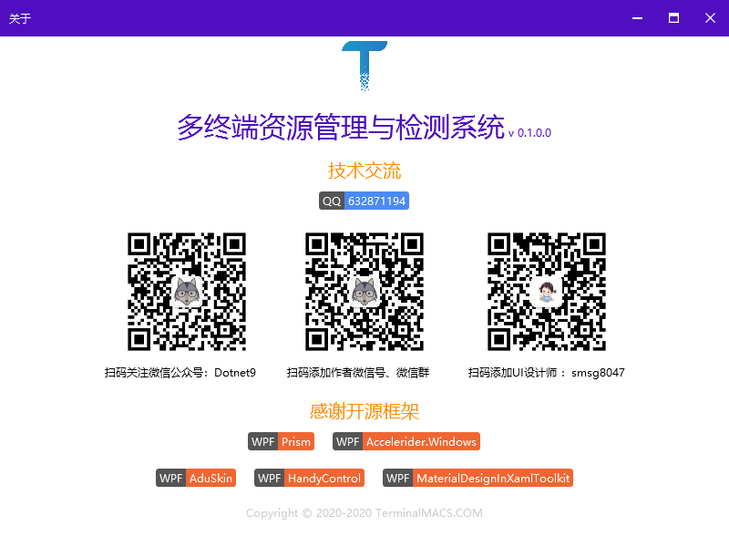
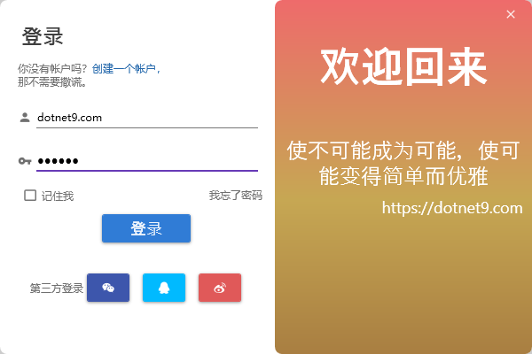
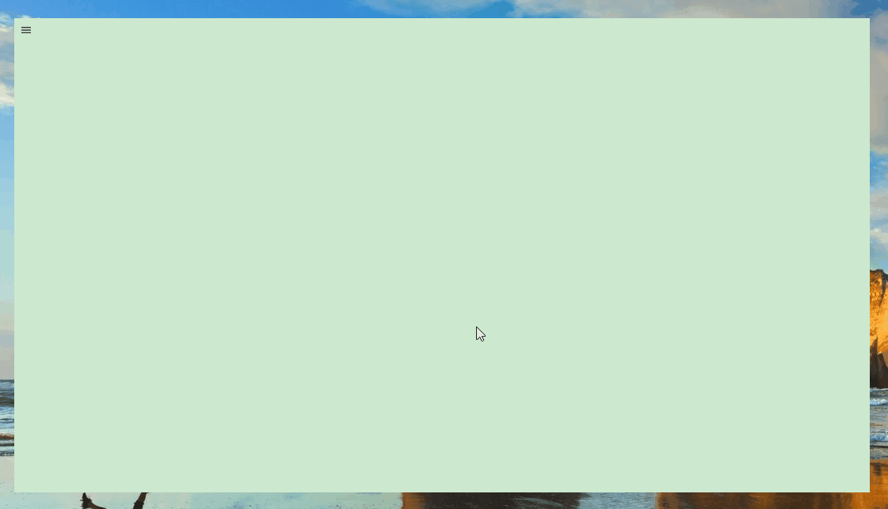
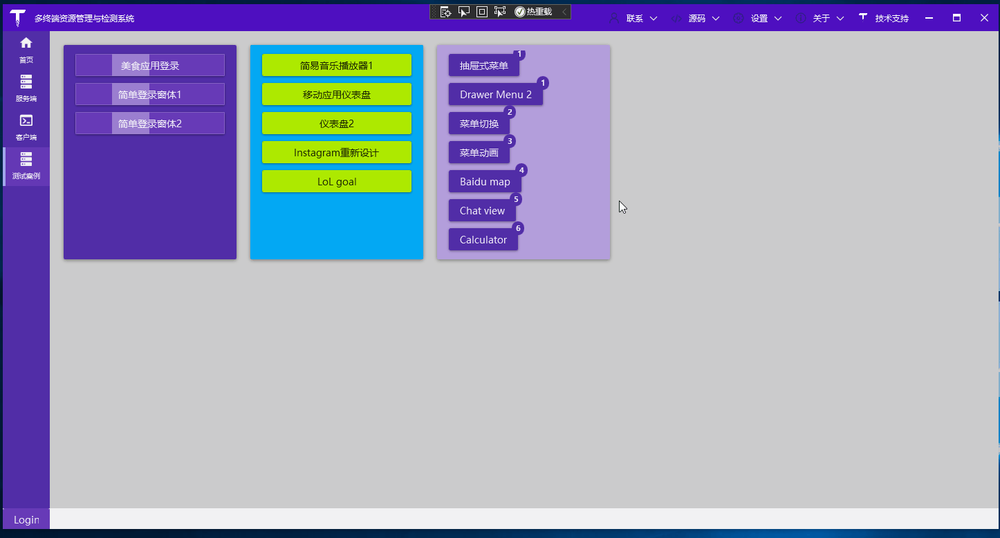
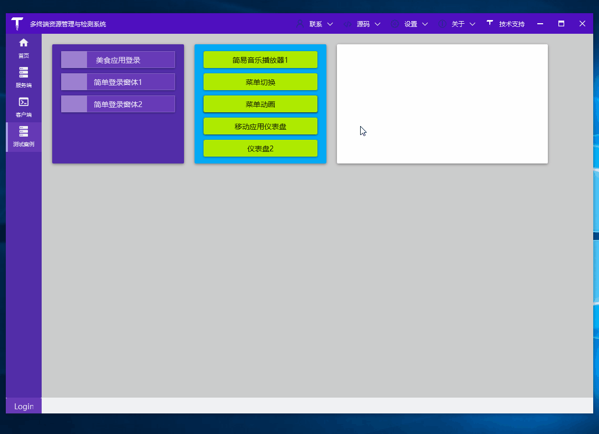
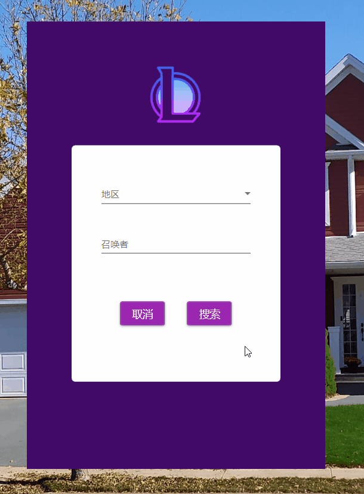
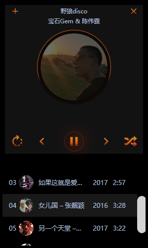
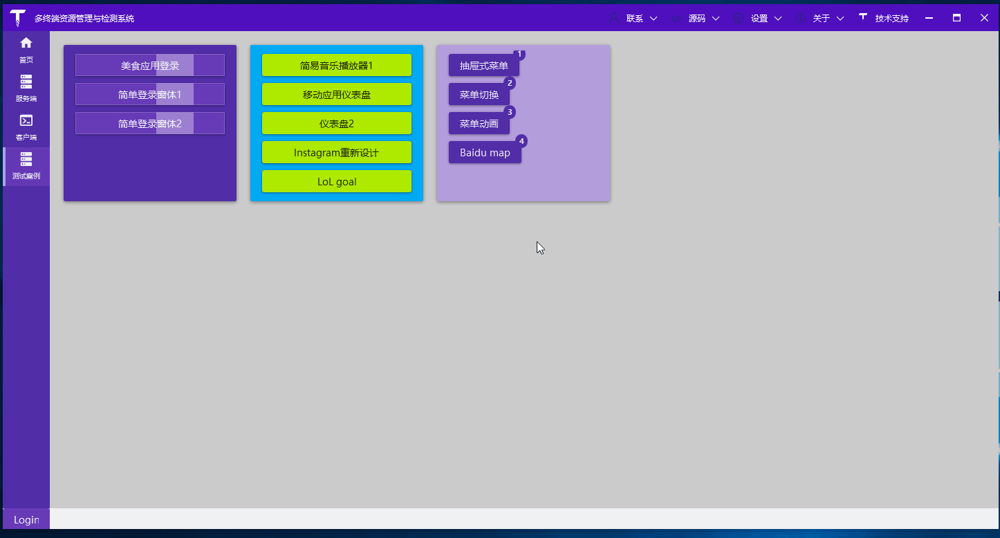
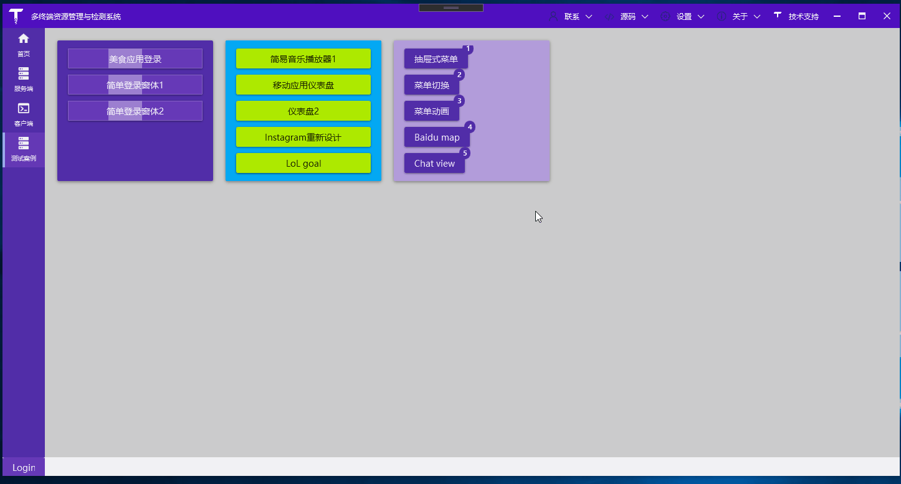
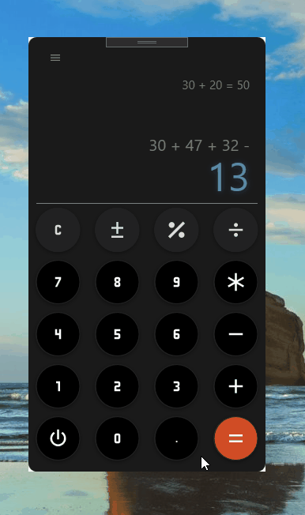

<p align="center">
  <a href="https://dotnet9.com">
    
  </a>
</p>

<h1 align="center">TerminalMACS</h1>

一个使用 Prism 作为模块化框架、基于多个开源控件库作为UI控件选择、集成开源 UI 界面设计的 .NET 5 WPF 客户端项目。

[English](./README.md) | 简体中文

## 1. 特性

- 使用 [.NET 5](https://dotnet.microsoft.com/download/dotnet/5.0?utm_source=dotnet-website&utm_medium=banner&utm_campaign=preview5-banner) 开发，体验最新 .NET 平台（和 .NET Core 3.1 无缝兼容）

>.NET 5 是 .NET Framework 和 .NET Core 的未来，最终将成为一个统一平台，.NET5将包含ASP.NET核心、实体框架核心、WinForms、WPF、Xamarin 和 ML.NET。

- 基于 [Prism 8](https://github.com/PrismLibrary/Prism) 搭建模块化框架，方便程序扩展

>Prism为程序设计提供指导,旨在帮助用户更加容易的设计和构建丰富、灵活、易于维护WPF桌面应用程序。Prism使用设计模式（如MVVM,复合视图,事件聚合器），帮助你创建一个松耦合的程序。遵循这些设计模式原则，将目标程序解耦成独立的模块。这些类型的应用程序被称为复合应用程序。

- 已使用或即将使用到多个开源WPF控件库

多种开源 WPF UI 库选择，开发 WPF 项目更方便：[MaterialDesignInXamlToolkit](https://github.com/MaterialDesignInXAML/MaterialDesignInXamlToolkit)、 [HandyControl](https://github.com/HandyOrg/HandyControl)、 [PanuonUI.Silver](https://github.com/Panuon/PanuonUI.Silver)、 [AduSkin](https://github.com/aduskin/AduSkin)。

- ECharts

ECharts：[pie-doughnut](https://echarts.apache.org/examples/zh/editor.html?c=pie-doughnut)

- 本地化支持

- 动态国际化支持

- 支持主题色动态切换

## 2. 支持环境

- .NET 5.0。

## 3. 当前版本

0.1

## 4. 链接

- 官方网站：[Dotnet9](https://dotnet9.com)

## 5. 项目界面截图

### 5.1. 关于
<p align="center">
  <a href="https://dotnet9.com">
    
  </a>
</p>

<p align="center">关于TerminalMACS</p>

### 5.2. 首页模块

### 5.3. 服务端模块

### 5.4. 客户端模块

### 5.5. 测试案例

收集全球优秀的开源WPF界面设计

以下为2022年收集的案例
---

## 2022年05月10日 一个比较摩登的登录界面

- 参考视频：[C# WPF UI | How to Design Modern Login Page in WPF](https://www.youtube.com/watch?v=PoPUB1_q2kE&t=907s)
- 介绍文章：[WPF|分享一个登录界面设计](https://lequ.co/2022/05/wpf%e5%88%86%e4%ba%ab%e4%b8%80%e4%b8%aa%e7%99%bb%e5%bd%95%e7%95%8c%e9%9d%a2%e8%ae%be%e8%ae%a1/)


----

以下为2022年之前的收集。

**登录注册分类 1**

1. 简单登录窗体设计1

参考视频：[C# WPF Material Design UI: Login Window](https://www.youtube.com/watch?v=gBR1mbMEPnk)

参考源码：[Login2](https://github.com/Abel13/Login2)

<p align="center">
  
</p>

<p align="center">简单登录窗体设计1</p>

2. 简单登录窗体设计2

参考视频：[C# WPF Material Design UI: Login Window](https://www.youtube.com/watch?v=9Y2EvautQnM)

参考源码：[Login1](https://github.com/Abel13/Login1)

<p align="center">
  
</p>

<p align="center">简单登录窗体设计2</p>

3. 美食应用登录

参考视频：[WPF Food App Login UI Material Design [Speed Design]](https://www.youtube.com/watch?v=1i5oWNvIYmo)

<p align="center">
  
</p>

<p align="center">美食应用登录</p>

**菜单类 2**

1. 抽屉式菜单1

参考视频：[C# WPF Material Design UI: Animated Colorful Navigation Drawer](https://www.youtube.com/watch?v=PQFyoKKfstM)

参考源码：[AnimatedColorfulMenu](https://github.com/Abel13/AnimatedColorfulMenu)

<p align="center">
  
</p>

<p align="center">抽屉式菜单1</p>

2. 抽屉式菜单2

参考视频：[WPF - Navigation Drawer / Sidebar Menu | UI Design | C# |](https://www.youtube.com/watch?v=fzBcXicj2G8)

参考源码：[Navigation-Drawer-Sidebar-Menu-in-WPF](https://github.com/CSharpDesignPro/Navigation-Drawer-Sidebar-Menu-in-WPF)

<p align="center">
  
</p>

<p align="center">抽屉式菜单2</p>

3. 菜单切换用户控件

参考视频：[C# WPF Material Design UI: Fast Food Sales](https://www.youtube.com/watch?v=VNYOKc1PLqA&t=24s)

参考源码：[Pizzaria1](https://github.com/Abel13/Pizzaria1)

<p align="center">
  
</p>

<p align="center">菜单切换用户控件</p>

4. 菜单切换动画

参考视频：[C# WPF Material Design UI: Animated Menu](https://www.youtube.com/watch?v=yrnE2Aah4B4&t=23s)

参考源码：[AnimatedMenu1](https://github.com/Abel13/AnimatedMenu1)

<p align="center">
  
</p>

<p align="center">菜单切换用户控件</p>

**其他界面设计 3**

1. 移动应用仪表盘

参考视频：[WPF Dashboard UI – Material Design [Speed Design]](https://www.youtube.com/watch?v=h962rCLfGuA&t=282s)

参考源码：[WPF-Dashboard-UI-Material-Design-Concept](https://github.com/vasanthmes/WPF-Dashboard-UI-Material-Design-Concept)

<p align="center">
  
</p>

<p align="center">移动应用仪表盘</p>

2. 简易仪表盘2

参考视频：[WPF Dashboard UI – Material Design [Speed Design]](https://www.youtube.com/watch?v=h962rCLfGuA&t=282s)

参考源码：[WPF-Dashboard-UI-Material-Design-Concept](https://github.com/vasanthmes/WPF-Dashboard-UI-Material-Design-Concept)

ECharts：[pie-doughnut](https://echarts.apache.org/examples/zh/editor.html?c=pie-doughnut)

<p align="center">
  
</p>

<p align="center">简易仪表盘2</p>

3. Instagram重新设计

参考视频：[C# WPF Material Design UI: Redesign Instagram](https://www.youtube.com/watch?v=X-FcXgDnglA&t=39s)

参考源码：[Instagram](https://github.com/Abel13/Instagram)

<p align="center">
  
</p>

<p align="center">Instagram重新设计</p>

4. LoLGoal

参考视频：[dotnet9](https://dotnet9.com/7026.html)

参考源码：[dotnet9](https://dotnet9.com/7026.html)

<p align="center">
  
</p>

<p align="center">LoLGoal</p>

5. 简易音乐播放器1

参考视频：[C# WPF Material Design UI: Dashboard](https://www.youtube.com/watch?v=sgEhK3mbDYo&t=26s)

参考源码：[Dashboard](https://github.com/Abel13/Dashboard1)

<p align="center">
  
</p>

<p align="center">简易音乐播放器1</p>

6. 百度地图

<p align="center">
  
</p>

<p align="center">百度地图</p>

6. 聊天界面设计

参考视频：
- [C# WPF Design UI – 1/3 – Contact List](https://www.youtube.com/watch?v=SzPj59ioTNc)
- [C# WPF Design UI – 2/3 – Profile](https://www.youtube.com/watch?v=wkoXTj2UgzM)
- [C# WPF Design UI – 3/3 – Chat](https://www.youtube.com/watch?v=834UHMisrxw&t=25s)

参考源码：[Chat](https://github.com/Abel13/Chat/tree/chat/Chat)

<p align="center">
  
</p>

<p align="center">聊天界面设计</p>

7. 计算器

参考视频：
- [Calcalator](https://www.youtube.com/watch?v=G76O79eLcKM)

<p align="center">
  
</p>

<p align="center">计算器</p>

## 更新记录

### 2020-11-15 添加快捷应用：src\Tools\QuickApp

参考开源项目：

https://github.com/yanjinhuagood/SoftWareHelper 

文章

https://www.cnblogs.com/yanjinhua/p/13896894.html

Dotnet9站点介绍文章：https://dotnet9.com/16722.html


功能：

1. ☑菜单通过配置文件配置，因为操作系统可能装了太多应用，不需要全部加载。

后面计划改成sqlite数据库存储：
```json
{
  "IsPowerOn": true,
  "MenuItemInfos": [
    {
      "FilePath": "C:\\Program Files\\Google\\Chrome\\Application\\chrome.exe",
      "IconPath": null,
      "Name": "Google Chrome",
      "Type": 0
    },
    {
      "FilePath": "https://dotnet9.com/",
      "IconPath": "logo.png",
      "Name": "Dotnet9",
      "Type": 1
    },
    {
      "FilePath": "mstsc /v:192.168.1.133",
      "IconPath": "shell.png",
      "Name": "192.168.1.133",
      "Type": 2
    }
  ]
}
```
2. ☑支持exe拖拽（或者系统生成的快捷方式拖拽）添加。

```C#
private void Grid_Drop(object sender, DragEventArgs e)
{
    try
    {
        var fileName = ((System.Array)e.Data.GetData(DataFormats.FileDrop)).GetValue(0).ToString();
        MenuItemInfo menuItem = new MenuItemInfo() { FilePath = fileName };

        // 快捷方式需要获取目标文件路径
        if (fileName.ToLower().EndsWith("lnk"))
        {
            WshShell shell = new WshShell();
            IWshShortcut wshShortcut = (IWshShortcut)shell.CreateShortcut(fileName);
            menuItem.FilePath = wshShortcut.TargetPath;
        }
        ImageSource imageSource = SystemIcon.GetImageSource(true, menuItem.FilePath);
        System.IO.FileInfo file = new System.IO.FileInfo(fileName);
        if (string.IsNullOrWhiteSpace(file.Extension))
        {
            menuItem.Name = file.Name;
        }
        else
        {
            menuItem.Name = file.Name.Substring(0, file.Name.Length - file.Extension.Length);
        }
        menuItem.Type = MenuItemType.Exe;

        if (ConfigHelper.AddNewMenuItem(menuItem))
        {
            var btn = AddMenuItem(menuItem);
            fishButtons.Children.Add(btn);
        }
    }
    catch (Exception ex)
    {
        MessageBox.Show(ex.Message);
    }
}

private void Grid_DragEnter(object sender, DragEventArgs e)
{
    if (e.Data.GetDataPresent(DataFormats.FileDrop))
    {
        e.Effects = DragDropEffects.Link;
    }
    else
    {
        e.Effects = DragDropEffects.None;
    }
}
```

```json
{
  "FilePath": "C:\\Program Files\\Google\\Chrome\\Application\\chrome.exe",
  "IconPath": null,
  "Name": "Google Chrome",
  "Type": 0
}
```

3. ☑支持网址配置（点击打开指定网址，类似网页收藏快捷方式）。
```json
{
  "FilePath": "https://dotnet9.com/",
  "IconPath": "logo.png",
  "Name": "Dotnet9",
  "Type": 1
}
```

```C#
 else if (menuItem.Type == MenuItemType.Web)
{
    Process.Start(new ProcessStartInfo("cmd", $"/c start {menuItem.FilePath}")
    {
        UseShellExecute = false,
        CreateNoWindow = true
    });
}
```

4. ☑支持cmd命令配置（比如系统应用mstsc,远程桌面配置目标IP及端口，一键打开连接等）

```json
{
  "FilePath": "mstsc /v:192.168.1.133",
  "IconPath": "shell.png",
  "Name": "192.168.1.133",
  "Type": 2
}
```

```C#
else if( menuItem.Type == MenuItemType.Cmd)
{
    Process p = new Process();
    p.StartInfo.FileName = "cmd";
    p.StartInfo.UseShellExecute = false;
    p.StartInfo.RedirectStandardInput = true;
    p.StartInfo.RedirectStandardOutput = true;
    p.StartInfo.RedirectStandardError = true;
    p.StartInfo.CreateNoWindow = true;
    p.Start();

    p.StandardInput.WriteLine($"{menuItem.FilePath} &exit");
    p.StandardInput.AutoFlush = true;
    p.WaitForExit();
    p.Close();
}
```

5. ☒提供界面配置菜单
6. ☒显示图标与文字
...更多想法还在想

### 2020-11-16 添加DotNetty服务端与客户端：src\Tools\NettyTest

公司项目有使用到DotNetty与java端Netty项目通信，所以花时间整了这个demo，打算一直维护下去。

功能：

- 服务端和客户端都采用 C# + WPF开发