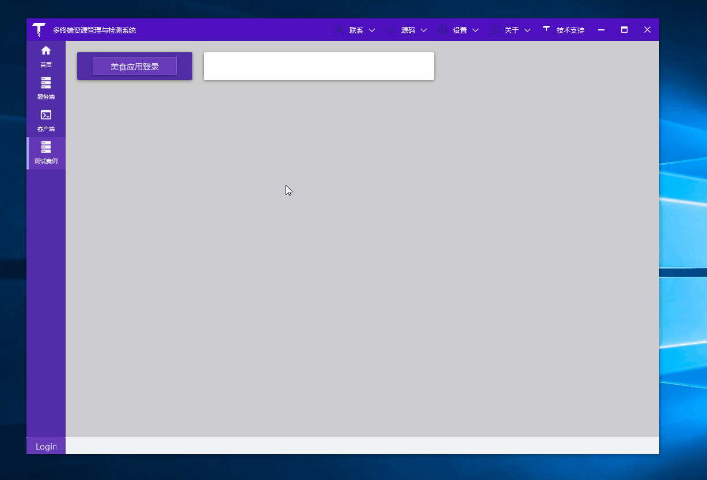
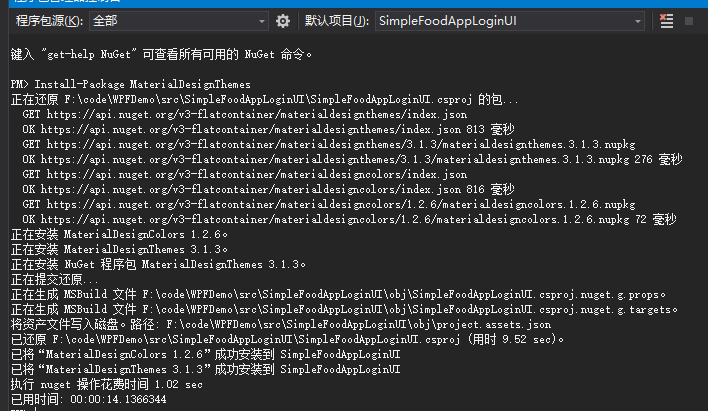

# .NET 5 开发WPF - 美食应用登录UI设计

Demo演示：



你的时间宝贵，不想看啰嗦的文字，可直接拉到文末下载源码！

## 1. 新建项目

站长开发环境：

- VS 2019企业版 16.70
- .NET 5 Preview 5

.NET 5 WPF 项目模板和 .NET Core 3.1 WPF 项目模板没有区别，创建好项目后，NuGet 引入 MaterialDesignThemes 库：




## 2.引入样式

演示Demo就一个xaml文件和xaml.cs文件，为了方便后面收集WPF界面设计效果，统一放在了开源项目[TerminalMACS.ManagerForWPF](https://github.com/dotnet9/TerminalMACS.ManagerForWPF "TerminalMACS.ManagerForWPF")中，所以控件样式引用直接在FoodAppLoginView.xaml中添加：

```HTML
<Window.Resources>
    <ResourceDictionary>
        <ResourceDictionary.MergedDictionaries>
            <ResourceDictionary Source="pack://application:,,,/MaterialDesignThemes.Wpf;component/Themes/MaterialDesignTheme.Light.xaml" />
            <ResourceDictionary Source="pack://application:,,,/MaterialDesignThemes.Wpf;component/Themes/MaterialDesignTheme.Defaults.xaml" />
            <ResourceDictionary Source="pack://application:,,,/MaterialDesignColors;component/Themes/Recommended/Primary/MaterialDesignColor.Amber.xaml" />
            <ResourceDictionary Source="pack://application:,,,/MaterialDesignColors;component/Themes/Recommended/Accent/MaterialDesignColor.Lime.xaml" />
        </ResourceDictionary.MergedDictionaries>
    </ResourceDictionary>
</Window.Resources>
```

## 3.控件动画效果

见上面GIF动画，登录窗口加载时，用户名输入框、密码输入框、记住密码、右侧背景图片等元素有动画效果，每个部分代码结构类似，比如下面的用户名输入框代码：

```HTML
<!--#region User name textblox-->
<materialDesign:TransitioningContent Grid.Row="2" Margin="90,20,00,0" HorizontalAlignment="Left">
    <materialDesign:TransitioningContent.OpeningEffects>
        <materialDesign:TransitionEffect Kind="SlideInFromLeft" Duration="0:0:2"/>
    </materialDesign:TransitioningContent.OpeningEffects>
    <StackPanel Style="{StaticResource setVisibilityBasedLogin}" Orientation="Horizontal">
        <materialDesign:PackIcon Kind="Account" Width="16" Height="16" VerticalAlignment="Center"
                         Margin="0,5,10,0" Foreground="{Binding ElementName=NameTextBox, Path=BorderBrush}"/>
        <TextBox x:Name="NameTextBox" Width="140" materialDesign:HintAssist.Hint="{markup:I18n {x:Static i18NResources:Language.FoodAppLoginView_UserName}}"
                 Style="{StaticResource MaterialDesignFloatingHintTextBox}"/>
    </StackPanel>
</materialDesign:TransitioningContent>
<!--#endregion-->
```

使用了开源控件MD的TransitioningContent组件，其中TransitionEffect的Kind属性设置控件动画方向。

## 4. 模拟登录

登录按钮布局代码：

```HTML
<!--#region control panel-->
<materialDesign:TransitioningContent Grid.Row="4" Margin="40,20,0,0">
    <materialDesign:TransitioningContent.OpeningEffects>
        <materialDesign:TransitionEffect Kind="SlideInFromBottom" Duration="0:0:2"/>
    </materialDesign:TransitioningContent.OpeningEffects>
    <StackPanel Style="{StaticResource setVisibilityBasedLogin}" Orientation="Horizontal" HorizontalAlignment="Center">
        <CheckBox Content="{markup:I18n {x:Static i18NResources:Language.FoodAppLoginView_RememberMe}}"/>
        <Button Style="{StaticResource MaterialDesignRaisedButton}"
            Command="{x:Static materialDesign:DialogHost.OpenDialogCommand}"
            materialDesign:ButtonAssist.CornerRadius="20"
            Width="80" Height="40" Margin="120,0,0,0"
                Content="{markup:I18n {x:Static i18NResources:Language.FoodAppLoginView_Login}}"/>
    </StackPanel>
</materialDesign:TransitioningContent>
<!--#endregion-->
```

点击登录时，打开等待对话框（点击时绑定了materialDesign:DialogHost.OpenDialogCommand），在等待对话框的打开与关闭事件中做登录逻辑处理。

```C#
private async Task<bool> ValidateCreds()
{
    // 模拟登录
    // 你可以发送登录信息到服务器，得到认证回馈
    await Task.Delay(TimeSpan.FromSeconds(2));
    Random gen = new Random(DateTime.Now.Millisecond);
    int loginProb = gen.Next(100);
    return loginProb <= 20;
}

private async void OpenCB_DialogOpened(object sender, MaterialDesignThemes.Wpf.DialogOpenedEventArgs eventArgs)
{
    try
    {
        this.IsJustStarted = true;
        this.LoginStatusmsg = "";
        bool isLoggedIn = await ValidateCreds();
        if (isLoggedIn)
        {
            // 需要关闭登录对话框并显示主窗口
            eventArgs.Session.Close(true);
        }
        else
        {
            // 登录失败，设置false作为参数
            eventArgs.Session.Close(false);
        }
    }
    catch (Exception)
    {

        //throw;
    }
}

private void ClosingCB_DialogClosing(object sender, MaterialDesignThemes.Wpf.DialogClosingEventArgs eventArgs)
{
    if (eventArgs.Parameter == null)
    {
        return;
    }
    IsLoggedIn = (bool)eventArgs.Parameter;
    IsJustStarted = false;
    if(IsLoggedIn)
    {
        this.LoginStatusmsg = I18nManager.Instance.Get(I18nResources.Language.FoodAppLoginView_Success).ToString();
    }
    else
    {
        this.LoginStatusmsg = I18nManager.Instance.Get(I18nResources.Language.FoodAppLoginView_Fail).ToString();
    }
}
```

等待对话框打开事件中，模拟登录逻辑。

等待对话框关闭事件中，做界面响应信息。

## 5. 源码下载

上面只贴了部分关键代码，源码已放Github中。

参考视频：[WPF Food App Login UI Material Design [Speed Design]](https://www.youtube.com/watch?v=1i5oWNvIYmo "WPF Food App Login UI Material Design [Speed Design]")

Demo源码：[FoodAppLoginUI](https://github.com/dotnet9/TerminalMACS.ManagerForWPF/tree/master/src/TerminalMACS.TestDemo/Views/FoodAppLoginUI "FoodAppLoginUI")